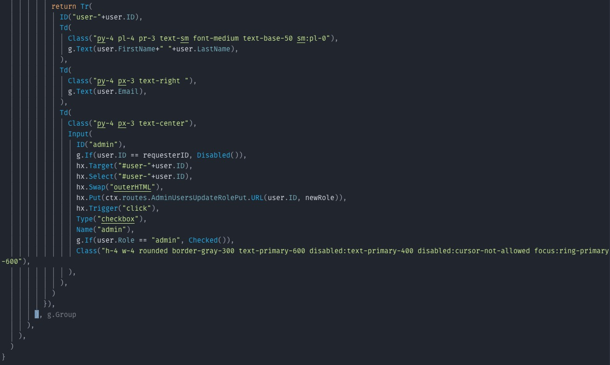

# paren-hint.nvim

## Purpose

I've recently been using [Gompontents](https://www.gomponents.com/) for my Go web projects. It's excellent for generating HTML in Go and I much prefer it to the other template options in Go.

My only gripe is that since all of my HTML is nested functions, it can be quite difficult to see exactly where I'm at when I'm trying to close a function or extract a section.

This plugin simply adds ghost text for whatever preceded the matching opening paren next to all closing parenthesis and brackets.

