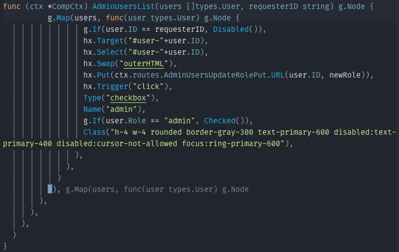
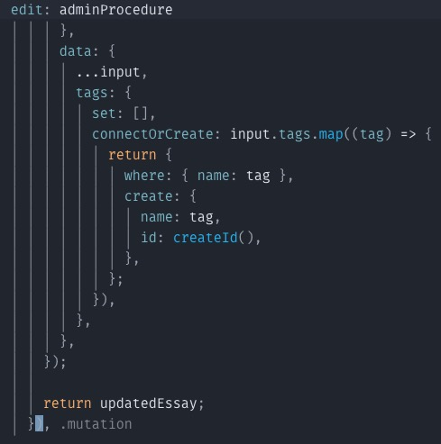

# paren-hint.nvim

## Purpose

Some of the libraries I use have a lot of nested parentheses. This makes it hard to see where the parentheses start. This plugin adds a ghost text to the right of the cursor that shows the text preceding the opening parentheses. This makes it easier to see where the parentheses start and where you are in the nesting.




## Installation

Add `"briangwaltney/paren-hint.nvim"` to your preferred package manager.

Lazy example

```lua
{
    "briangwaltney/paren-hint.nvim",
    lazy = false,
    config = function()
        require("paren-hint")
    end,
},
```
